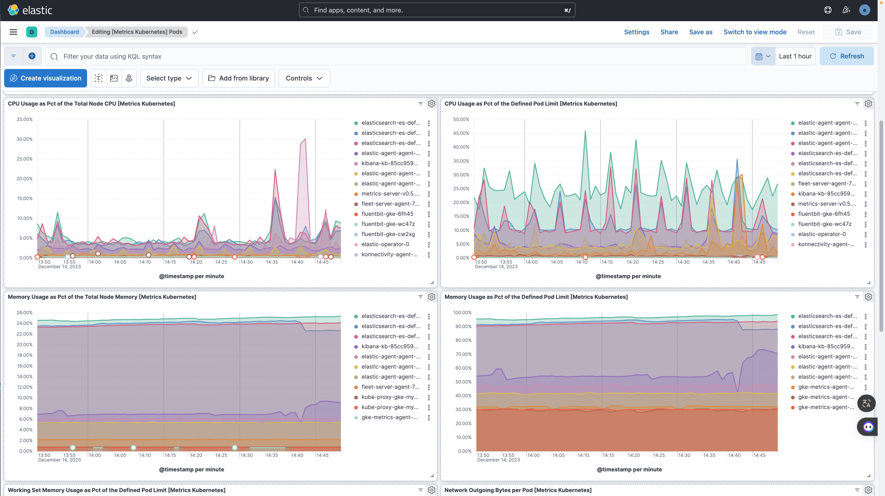

# Documentation de la solution de centralisation et de gestion des logs avec la suite Elastic :

Cette documentation détaille la mise en place d'une infrastructure de monitoring avec la suite Elastic. Elle offre un aperçu complet des fichiers et des répertoires associés à ce projet, facilitant ainsi le déploiement, la gestion et la compréhension de l'ensemble de l'architecture.

## Descriptions des fichiers fournis

L'arborescence du repository est conçue de manière à faciliter le déploiement et la gestion d'une infrastructure de monitoring avec la suite Elastic. Voici une vue d'ensemble des principaux fichiers et répertoires :

- `README.md et README-anglais.md` : Ces fichiers contiennent la documentation principale du projet, avec des instructions et des informations sur le déploiement et la gestion.
- `deploy-gke-cluster` : Ce répertoire contient les scripts et les configurations nécessaires pour déployer un cluster Google Kubernetes Engine (GKE) à l'aide d'Ansible et Terraform :
    - **README.md** : Ce fichier fournit des instructions détaillées sur le déploiement du cluster GKE à l'aide d'Ansible et Terraform. Il explique également la structure des fichiers présents dans ce répertoire.
    - **ansible** : Ce répertoire contient les scripts Ansible nécessaires pour automatiser le déploiement du cluster GKE. Les fichiers incluent des configurations (ansible.cfg, inventory.ini), un playbook principal (playbook.yml), des rôles spécifiques au cluster GKE, et des variables (vars.yml).
    - **creation-inventory.sh** : Un script pour créer l'inventaire nécessaire à Ansible.
    - **credentials.json** : Le fichier de configuration JSON nécessaire pour l'authentification Google Cloud Platform (GCP).
    - **deploy.sh** : Un script pour lancer le déploiement du cluster GKE.
    - **terraform** : Ce répertoire contient les configurations Terraform pour la création de l'infrastructure GCP, y compris le réseau VPC, le pare-feu, le service account, et le cluster GKE lui-même.
    - **terraform-destroy.sh** : Un script pour détruire l'infrastructure créée avec Terraform.
- `kubernetes` : Ce répertoire inclut les configurations Kubernetes pour le déploiement des différentes applications, telles que Elasticsearch, Filebeat, Kibana, Logstash, et Nginx :
  - **app** : Contient les configurations Kubernetes pour le déploiement de l'application, avec des fichiers YAML décrivant le déploiement et le service.
  - **elasticsearch, filebeat, kibana, logstash, nginx** : Ces répertoires contiennent les configurations Kubernetes spécifiques à chaque composant de la suite Elastic.
  - **values.yaml** : Un fichier de valeurs pour la configuration globale utilisé dans les déploiements Helm.
- `logging-schema` : Contient un schéma de la centralisation des logs au format PDF, facilitant la compréhension de l'architecture.
- `screenshots` : Capture d'écran des différents affichages et tableaux de bord liés aux logs et à la gestion des métriques du cluster.
- `tp_5_logging.pdf` : Le document PDF associé au TP sur le monitoring avec des explications détaillées.


``` shell
. # Arborescence du repository
├── README.md
├── README-anglais.md
├── deploy-gke-cluster
│   ├── README.md
│   ├── ansible
│   │   ├── ansible.cfg
│   │   ├── inventory.ini
│   │   ├── playbook.yml
│   │   ├── roles
│   │   │   └── gke-cluster
│   │   │       ├── handlers
│   │   │       │   └── main.yml
│   │   │       └── tasks
│   │   │           └── main.yml
│   │   └── vars.yml
│   ├── creation-inventory.sh
│   ├── credentials.json
│   ├── deploy.sh
│   ├── terraform
│   │   ├── firewall
│   │   │   ├── main.tf
│   │   │   ├── outputs.tf
│   │   │   └── variables.tf
│   │   ├── gke-cluster
│   │   │   ├── main.tf
│   │   │   ├── outputs.tf
│   │   │   └── variables.tf
│   │   ├── main.tf
│   │   ├── outputs.tf
│   │   ├── service_account
│   │   │   ├── main.tf
│   │   │   ├── outputs.tf
│   │   │   └── variables.tf
│   │   ├── terraform.tfstate
│   │   ├── terraform.tfstate.backup
│   │   ├── variables.tf
│   │   └── vpc
│   │       ├── main.tf
│   │       ├── outputs.tf
│   │       └── variables.tf
│   └── terraform-destroy.sh
├── kubernetes
│   ├── app
│   │   ├── app-deployment.yml
│   │   └── app-service.yml
│   ├── elasticsearch
│   │   ├── elasticsearch-deployment.yaml
│   │   └── elasticsearch-service.yaml
│   ├── filebeat
│   │   ├── filebeat-config.yaml
│   │   └── filebeat-deployment.yaml
│   ├── kibana
│   │   ├── kibana-deployment.yaml
│   │   └── kibana-service.yaml
│   ├── logstash
│   │   ├── logstash-configmap.yaml
│   │   ├── logstash-deployment.yaml
│   │   ├── logstash-nginx-pipeline.conf
│   │   └── logstash-service.yaml
│   ├── nginx
│   │   ├── nginx-deployment.yml
│   │   └── nginx-service.yml
│   └── values.yaml
├── logging-schema
│   └── centralisation-logs.drawio.pdf
├── screenshots
│   ├── Affichage-Dashboard-Cluster-Metrics.png
│   ├── Affichage-Index.png
│   ├── Affichage-Logs-24H.png
│   ├── Affichage-Logs-ConteneurUnique.png
│   ├── Affichage-Logs-NGINX.png
│   ├── Affichages-Logs-Kubernetes-Last1H.png
│   ├── Strategy-GestionLogs-72H-AccessLogs.png
│   └── Strategy-GestionLogs-72H-ErrorLogs.png
└── tp_5_logging.pdf

21 directories, 58 files
```

## Schéma visuel de la solution de monitoring ELK


## Comment déployer ELK et les applications dans le cluster :

Voici la procédure a suivre pour paramétrer le cluster GKE, le déployer et accéder a la solution de monitoring : 

### Paramétrage des variables pour le déploiement:

### Déploiement et accès au monitoring:

Une fois que vous avez effectué ces modifications des variables pour l'ensemble des dossiers, vous pouvez exécuter les scripts Terraform pour déployer et configurer le cluster GKE sur GCP en utilisant la commande suivante :

- se placer dans le dossier deploy-gke-cluster
- lancer la commande :
  
``` sh
    bash deploy.sh
```

Le script bash `deploy.sh` est un script de déploiement automatisé pour déployer une infrastructure sur Google Cloud Platform (GCP) et déployer un cluster GKE en mode normal afin de pouvoir régler finement tous les paramètres de celui ci.

- attendre 6 minutes que le cluster Kubernetes soit déployé
- la commande sudo qui lance Docker automatiquement peut vous demander le MDP Admin de l'ordinateur
- aller sur votre navigateur a cette URL : `localhost:5601`
- renseigner le nom d'utilisateur par : `elastic`
- renseigner le MDP par celui en rouge souligné dans le terminal : ex (eTE2YYBx...)
- cliquer sur `"Discover" dans le menu de gauche
- vous avez un apercu des logs récupérés par ELK :



- pour rajouter un agent de collecte de logs pour votre application (ici NGINX), dans la barre de recherche en haut taper le nom de votre agent (ici NGINX)
- cliquer sur `"Add NGINX"`
- verifier que dans Configure intégration , `collect logs from NGINX instances` est coché ainsi que les metrics
- dans 'Where to add this integration': cliquer sur l'onglet `'Existing hosts'` et sélectionner `'Elastic Agent on ECK policy'`
  
- cliquer sur hamburger, scroll down jusqu'a management, cliquer sur integration, cliquer sur `installer d'integration`, cliquer sur `Nginx`, cliquer sur `integration policies`, cliquer sur `nginx advanced options` , dans le champ Ignore events older than mettre la durée pour laquelle vous voulez conserver les logs ici 72h.

ENJOY !
