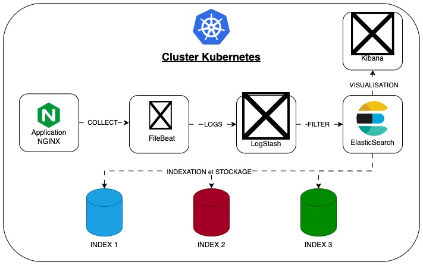

# Documentation de la solution de centralisation et de gestion des logs avec la suite Elastic :

Cette documentation détaille la mise en place d'une infrastructure de monitoring avec la suite Elastic. Elle offre un aperçu complet des fichiers et des répertoires associés à ce projet, facilitant ainsi le déploiement, la gestion et la compréhension de l'ensemble de l'architecture.

## Descriptions des fichiers fournis

L'arborescence du repository est conçue de manière à faciliter le déploiement et la gestion d'une infrastructure de monitoring avec la suite Elastic. Voici une vue d'ensemble des principaux fichiers et répertoires :

- `README.md et README-anglais.md` : Ces fichiers contiennent la documentation principale du projet, avec des instructions et des informations sur le déploiement et la gestion.
- `deploy-gke-cluster` : Ce répertoire contient les scripts et les configurations nécessaires pour déployer un cluster Google Kubernetes Engine (GKE) à l'aide d'Ansible et Terraform :
    - **README.md** : Ce fichier fournit des instructions détaillées sur le déploiement du cluster GKE à l'aide d'Ansible et Terraform. Il explique également la structure des fichiers présents dans ce répertoire.
    - **ansible** : Ce répertoire contient les scripts Ansible nécessaires pour automatiser le déploiement du cluster GKE. Les fichiers incluent des configurations (ansible.cfg, inventory.ini), un playbook principal (playbook.yml), des rôles spécifiques au cluster GKE, et des variables (vars.yml).
    - **creation-inventory.sh** : Un script pour créer l'inventaire nécessaire à Ansible.
    - **credentials.json** : Le fichier de configuration JSON nécessaire pour l'authentification Google Cloud Platform (GCP).
    - **deploy.sh** : Un script pour lancer le déploiement du cluster GKE.
    - **terraform** : Ce répertoire contient les configurations Terraform pour la création de l'infrastructure GCP, y compris le réseau VPC, le pare-feu, le service account, et le cluster GKE lui-même.
    - **terraform-destroy.sh** : Un script pour détruire l'infrastructure créée avec Terraform.
- `kubernetes` : Ce répertoire inclut les configurations Kubernetes pour le déploiement des différentes applications, telles que Elasticsearch, Filebeat, Kibana, Logstash, et Nginx :
  - **app** : Contient les configurations Kubernetes pour le déploiement de l'application, avec des fichiers YAML décrivant le déploiement et le service.
  - **elasticsearch, filebeat, kibana, logstash, nginx** : Ces répertoires contiennent les configurations Kubernetes spécifiques à chaque composant de la suite Elastic.
  - **values.yaml** : Un fichier de valeurs pour la configuration globale utilisé dans les déploiements Helm.
- `logging-schema` : Contient un schéma de la centralisation des logs au format PDF, facilitant la compréhension de l'architecture.
- `screenshots` : Capture d'écran des différents affichages et tableaux de bord liés aux logs et à la gestion des métriques du cluster.
- `tp_5_logging.pdf` : Le document PDF associé au TP sur le monitoring avec des explications détaillées.


``` shell
. # Arborescence du repository
├── README.md
├── README-anglais.md
├── deploy-gke-cluster
│   ├── README.md
│   ├── ansible
│   │   ├── ansible.cfg
│   │   ├── inventory.ini
│   │   ├── playbook.yml
│   │   ├── roles
│   │   │   └── gke-cluster
│   │   │       ├── handlers
│   │   │       │   └── main.yml
│   │   │       └── tasks
│   │   │           └── main.yml
│   │   └── vars.yml
│   ├── creation-inventory.sh
│   ├── credentials.json
│   ├── deploy.sh
│   ├── terraform
│   │   ├── firewall
│   │   │   ├── main.tf
│   │   │   ├── outputs.tf
│   │   │   └── variables.tf
│   │   ├── gke-cluster
│   │   │   ├── main.tf
│   │   │   ├── outputs.tf
│   │   │   └── variables.tf
│   │   ├── main.tf
│   │   ├── outputs.tf
│   │   ├── service_account
│   │   │   ├── main.tf
│   │   │   ├── outputs.tf
│   │   │   └── variables.tf
│   │   ├── terraform.tfstate
│   │   ├── terraform.tfstate.backup
│   │   ├── variables.tf
│   │   └── vpc
│   │       ├── main.tf
│   │       ├── outputs.tf
│   │       └── variables.tf
│   └── terraform-destroy.sh
├── kubernetes
│   ├── app
│   │   ├── app-deployment.yml
│   │   └── app-service.yml
│   ├── elasticsearch
│   │   ├── elasticsearch-deployment.yaml
│   │   └── elasticsearch-service.yaml
│   ├── filebeat
│   │   ├── filebeat-config.yaml
│   │   └── filebeat-deployment.yaml
│   ├── kibana
│   │   ├── kibana-deployment.yaml
│   │   └── kibana-service.yaml
│   ├── logstash
│   │   ├── logstash-configmap.yaml
│   │   ├── logstash-deployment.yaml
│   │   ├── logstash-nginx-pipeline.conf
│   │   └── logstash-service.yaml
│   ├── nginx
│   │   ├── nginx-deployment.yml
│   │   └── nginx-service.yml
│   └── values.yaml
├── logging-schema
│   └── centralisation-logs.drawio.pdf
├── screenshots
│   ├── Affichage-Dashboard-Cluster-Metrics.png
│   ├── Affichage-Index.png
│   ├── Affichage-Logs-24H.png
│   ├── Affichage-Logs-ConteneurUnique.png
│   ├── Affichage-Logs-NGINX.png
│   ├── Affichages-Logs-Kubernetes-Last1H.png
│   ├── Strategy-GestionLogs-72H-AccessLogs.png
│   └── Strategy-GestionLogs-72H-ErrorLogs.png
└── tp_5_logging.pdf

21 directories, 58 files
```

## Schéma visuel de la solution de monitoring ELK



## Configuration des paramètres

Les paramètres du pipeline CI/CD peuvent être configurés en définissant des variables dans le fichier `.gitlab-ci.yml`. Les variables suivantes sont disponibles :

- **Étape "retrieve_image"**:
    - `DOCKER_REGISTRY`: L'URL du registre Docker pour stocker l'image Docker (par défaut, "docker.io" est le registre Docker public).
    - `DOCKER_USER`: Le nom d'utilisateur du compte Docker Hub.
    - `DOCKER_REPO`: Le nom du repository Docker où est stockée l'image Docker.
    - `DOCKER_IMAGE_VERSION`: Le nom de la version de l'image construite et poussée sur le Hub Docker.
    - `IMAGE_REPO_PATH`: Le chemin où l'artifact de l'image Docker sera enregistré.
    - `IMAGE_OS`: L'image Docker utilisée pour les jobs de la pipeline.
- **Étape "check_vulnerabilities"**:
    - `CHECK_VULNERABILITIES_REPORT_PATH`: Le chemin vers les rapports de vérification de vulnérabilités.
- **Étape "deploy"**:
    - `ENVIRONMENT_TYPE`: Le type d'environnement cible (dev, test, prod).
- **Étape "retrieve_ip_and_port"**:
    - `dev`:
        - `GCLOUD_PROJECT_ID`: L'ID du projet Google Cloud.
        - `GCLOUD_ZONE`: La zone Google Cloud.
        - `VM_NAME`: Le nom de la machine virtuelle.
        - `CONTAINER_NAME`: Le nom du conteneur Docker.
        - `IMAGE_NAME`: Le nom de l'image Docker.
- **Étape "functional_test"**:
    - `ROBOTFRAMEWORK_REPORT_PATH`: Le chemin vers les rapports Robotframework.
    - `ROBOTFRAMEWORK_FILE`: Le chemin des fichiers de tests fonctionnels Robotframework.

## Étapes du pipeline

Le pipeline CI/CD est composé des 6 étapes suivantes :

1. `retrieve_image` : Cette étape vise à récupérer une image Docker depuis un registre (par exemple, Docker Hub) et à la stocker localement pour une utilisation ultérieure.
2. `check_vulnerabilities` : Dans cette étape, nous vérifions les vulnérabilités de l'image Docker en utilisant Scout-CLI. Les rapports de vulnérabilités sont enregistrés pour une évaluation ultérieure.
3. `deploy_dev, deploy_test, deploy_prod` : Ces étapes sont responsables du déploiement de l'application dans différents environnements (développement, test, production) en fonction de la valeur de la variable ENVIRONMENT_TYPE. Chacune de ces étapes déploie l'application sur une plateforme spécifique.
4. `retrieve_ip_and_port_dev, retrieve_ip_and_port_test, retrieve_ip_and_port_prod` : Ces étapes récupèrent l'adresse IP et le port de l'application déployée dans chaque environnement. Cela permet de connaître l'emplacement de l'application pour effectuer des tests ou des validations ultérieures.
5. `functional_test` : Cette étape exécute des tests fonctionnels à l'aide de Robot Framework. Les résultats des tests sont enregistrés dans un répertoire spécifique.
6. `generate_global_report` : Cette dernière étape compile les informations des tests et récupère les adresses IP et les ports en fonction de l'environnement. Elle crée un fichier de rapport au format HTML qui résume ces informations. Le rapport est ensuite archivé en tant qu'artefact pour un accès ultérieur.

Le pipeline est composé de 6 étapes :

1. Étape "retrieve_image" :
    - Connexion à un registre Docker.
    - Téléchargement de l'image Docker depuis le registre.

2. Étape "check_vulnerabilities" :
    - Connexion au registre Docker.
    - Installation de l'outil Scout-CLI pour la vérification des vulnérabilités.
    - Téléchargement de l'image Docker depuis le registre.
    - Exécution de Scout-CLI pour afficher les vulnérabilités de l'image Docker.

3. Étape "deploy" :
    - Déploiement de l'application sur un environnement spécifique (développement, test, production) en fonction de la variable "ENVIRONMENT_TYPE".
    - Connexion au registre Docker.
    - Authentification à l'aide de Docker pour pousser l'image.
    - Téléchargement de fichiers de configuration.
    - Déploiement de l'application sur l'environnement cible.

4. Étape "retrieve_ip_and_port" :
    - Récupération de l'adresse IP et du port de l'application en fonction de l'environnement (développement, test, production).
    - Utilisation des outils Google Cloud SDK pour l'environnement de développement.
    - Utilisation de Docker pour les environnements de test et de production.

5. Étape "functional_test" :
    - Installation des dépendances nécessaires.
    - Exécution de tests fonctionnels à l'aide de Robot Framework.
    - Génération de rapports de test.

6. Étape "generate_global_report" :
    - Compilation des informations des tests précédents.
    - Récupération des adresses IP et des ports en fonction de l'environnement.
    - Création d'un fichier de rapport au format HTML en utilisant les informations compilées.
    - Archivage du rapport en tant qu'artefact avec des dépendances sur les étapes précédentes.

Ce fichier .gitlab-ci.yml vise à automatiser le processus de développement, du test à la délivrance, tout en garantissant la qualité du code et en fournissant des rapports complets pour chaque étape du pipeline.

## Exécution du pipeline CI/CD

Pour exécuter ce pipeline sur GitLab, vous devez suivre ces étapes :

1. Placez-vous à l'endroit souhaité et y copier le repo suivant :

```bash
git clone https://gitlab.com/JoffreyBENA/TP4-CD.git
```

2. Configurez une nouvelle variable d'environnement $GITLAB_HOME pointant vers le répertoire où se trouvera la configuration, les journaux et les fichiers de données. Assurez-vous que le répertoire existe et que les autorisations appropriées ont été accordées.

    - pour les utilisateurs Linux, définissez le chemin sur /srv/gitlab :

        ```bash
        export GITLAB_HOME = /srv/gitlab
        ```

    - pour les utilisateurs macOS, utilisez le répertoire $HOME/gitlab de l'utilisateur :

        ```bash
        export GITLAB_HOME = /var/folders/gitlab
        ```

3. Lancer le conteneur docker-compose :

``` bash
docker-compose up -d
```

Cela peut prendre quelques minutes (environ 5 minutes) le temps de que les conteneurs finissent de se lancer. Vérifier leurs états en effectuant la commande :

``` bash
docker-compose ps
```

Attendre ques les 2 conteneurs soient en état "Up".

4. Accéder a votre instance Gitlab en ouvrant votre navigateur et en entrant l'URL suivante : [http://localhost:8080](http://localhost:8080).
Connectez-vous avec le nom d'utilisateur **"root"** et le mot de passe préalablement obtenu en faisant la commande :

``` bash
docker exec -it gitlab-ce grep 'Password:' /etc/gitlab/initial_root_password
```

5. Avant de continuer, il vaut la peine de modifier quelques paramètres de Gitlab :

    - Tout d'abord, nous désactiverons l'enregistrement ouvert pour tout le monde.
    Pour ce faire, cliquez sur le bouton "Afficher les paramètres" disponible sur la barre supérieure avec un avertissement (adresse vers le panneau ; [http://localhost:8080/admin/application_settings/general#js-signup-settings](http://localhost:8080/admin/application_settings/general#js-signup-settings)). 
    Sur la nouvelle page, décochez `Inscription activée` et enregistrez les modifications.

    - La prochaine étape devrait consister à changer l'utilisateur root. Pour ce faire, rendez-vous sur le site web: [http://localhost:8080/-/profile/account](http://localhost:8080/-/profile/account) et entrez le nom dans le champ `Changer le nom d'utilisateur`.
    Nous approuvons en cliquant sur `Mettre à jour le nom d'utilisateur`.

    - Ensuite, nous allons changer le mot de passe. Pour ce faire, rendez-vous sur le site web: [http://localhost:8080/-/profile/password/edit](http://localhost:8080/-/profile/password/edit) et entrez le mot de passe dans le champ `Changer le mot de passe`.
    Nous approuvons en cliquant sur `Mettre à jour le mot de passe`.

6. Afin de pouvoir importer un projet, suivez ces instructions :

    - Sign in to GitLab as a user with Administrator access level.
    - On the left sidebar, select **Search or go to**.
    - Select **Admin Area**.
    - Select **Settings > General**.
    - Expand the **Import and export settings** section.
    - Select each of **Import sources** to allow. (in our case : Repository vy URL)
    - Select **Save changes**.

7. Créez un nouveau projet sur GitLab. Cliquez sur le logo Gitlab (Homepage) puis sur Create Project (Création de projet), puis cliquez sur Import project (Importer un projet). Cliquez sur `Repository by URL`, dans le champ entrez "Git repository URL", l'URL du dépôt Git à cloner [https://gitlab.com/JoffreyBENA/TP4-CD.git](https://gitlab.com/JoffreyBENA/TP4-CD.git).
Cliquez sur `Create project` (Créer un projet) pour créer le projet.

8. Ajouter une variables d'environnement sensible $DOCKER_TOKEN sur Gitlab :

    - Connecter vous a votre compte Docker Hub, cliquez sur votre avatar en haut à droite, puis cliquez sur **Account Settings** (Paramètres du compte). Dans le menu de gauche, cliquez sur **Security** (Sécurité), puis cliquez sur **New Access Token** (Nouveau jeton d'accès). Entrez un nom pour le jeton d'accès, puis cliquez sur **Create** (Créer). Copiez le jeton d'accès et conservez-le en lieu sûr.

    - Ensuite, allez dans votre projet sur GitLab, cliquez sur **Settings** (Paramètres) dans le menu de gauche, puis cliquez sur **CI/CD**. Déroulez la section **Variables**, ajoutez la variable $DOCKER_TOKEN et sa valeur (préalablement copié a l'étape précédente), puis cliquez sur Add Variable (Ajouter une variable).

9. Ajout du fichier sécurisé (Secure File) sur GtiLab :
    - Dans le menu de gauche, cliquez sur "Settings" (Paramètres).
    - Sous "General" (Général), sélectionnez "CI/CD" dans le sous-menu.
    - Faites défiler jusqu'à la section "Secure Files". C'est ici que vous pouvez ajouter des fichiers sécurisés.
    - Cliquez sur le bouton "Expand" (Développer) à côté de "Secure Files".
    - Dans cette section, vous verrez un champ pour ajouter un fichier sécurisé. Cliquez sur "Add a new file" (Ajouter un nouveau fichier).
    - Une fenêtre contextuelle s'ouvrira pour vous permettre d'ajouter le fichier sécurisé. Sélectionnez le fichier depuis votre système local.
    - Une fois que vous avez sélectionné le fichier, vous pouvez lui donner un nom et une description.
    - Cliquez sur "Save" (Enregistrer) pour ajouter le fichier sécurisé à votre projet.

Le fichier sécurisé est maintenant stocké sur GitLab et peut être utilisé dans vos pipelines CI/CD. Vous pouvez y accéder et l'utiliser dans vos jobs en référençant son nom dans votre fichier .gitlab-ci.yml ou dans vos scripts de pipeline.

10. Configuration du runner Gitlab :

    - Dans un premier temps, copier le token d'enregistrement du runner gitlab. Pour ce faire, allez a cette URL `http://localhost:8080/admin/runners` , cliquez sur les trois petits points en haut a droite, puis sur le bouton de "Copy Registration Token".

    - Pour enregistrer le runner Gitlab, vous devez exécuter la commande suivante sur le serveur Gitlab :

        ``` bash
        docker exec -it gitlab-runner gitlab-runner register --url "http://gitlab-ce" --clone-url "http://gitlab-ce"
        ```

        - Entrer l'URL de l'instance Gitlab : confirmer la valeur par default en faisant "Entrée"
        - Entrez le jeton d’enregistrement : entrez le token copié auparavant
        - Entrez une description pour le runner : entrez le nom du runner, par exemple `tp4-gitlab-runner`
        - Entrez des tags pour le runner : laissez ce champ vide ici
        - Entrez un exécuteur : entrez `docker` ici
        - Entrez l’image Docker par défaut : ici nous fournissons l’image `docker:latest`

    - Configuration du fichier `config.toml` du conteneur `gitlab-runner` :

        ``` bash
        ./configure_runner.sh
        ```

    Ce script bash permet d'automatiser :
    - Ajout de la ligne `network_mode = "gitlab-network"` pour le connecter au réseau `gitlab-network`
    - Modification de la ligne volumes du "runner.docker" par : `volumes = ["/var/run/docker.sock:/var/run/docker.sock", "/cache"]`

11. Modifier les variables d'environnement du fichier `.gitlab-ci.yml` selon votre application et vos besoins. Concernant la variable DOCKER_REPO, il faut créer un repository sur Docker Hub, pour cela connecter vous sur Docker Hub, cliquez sur **Create Repository** (Créer un dépôt), entrez le nom du dépôt, puis cliquez sur **Create** (Créer). Vous pouvez maintenant modifier la variable DOCKER_REPO avec le nom du dépôt créé.

12. Pour lancer la pipeline CI/CD, allez dans votre projet sur GitLab, cliquez sur **Build** dans le menu de gauche, puis cliquez sur **Pipelines**. Cliquez sur **Run pipeline** (Exécuter le pipeline) pour lancer le pipeline CI/CD. Vous pouvez constater l'état d'avancement de votre pipeline sur l'écran qui est affiché, et vous pouvez cliquer sur chaque Jobs pour avoir le détails des logs de chacun.

13. Pour voir les rapports de test, allez dans votre projet sur GitLab, cliquez sur **Build** dans le menu de gauche, puis cliquez sur **Artifacts**. Cliquez sur le job que vous souhaitez voir. Vous pouvez télécharger les rapports de test à partir de là.

14. Pour voir l'image Docker construite, allez sur Docker Hub et connectez-vous avec les informations d'identification de votre compte Docker Hub. Vous devriez voir l'image Docker construite dans votre compte Docker Hub.

ENJOY !

[](https://gitlab.com/JoffreyBENA/TP4-CD/-/commits/main)