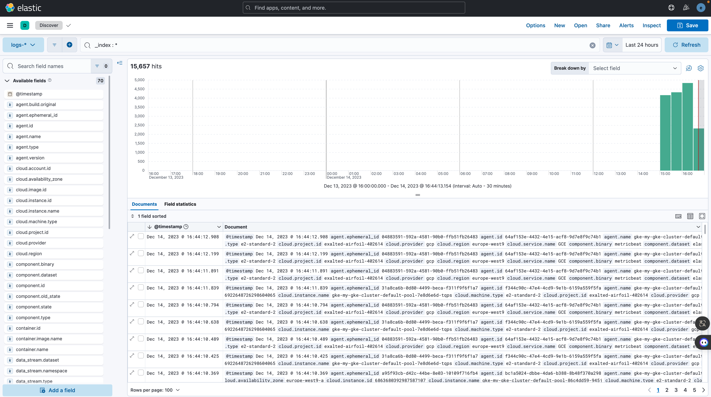
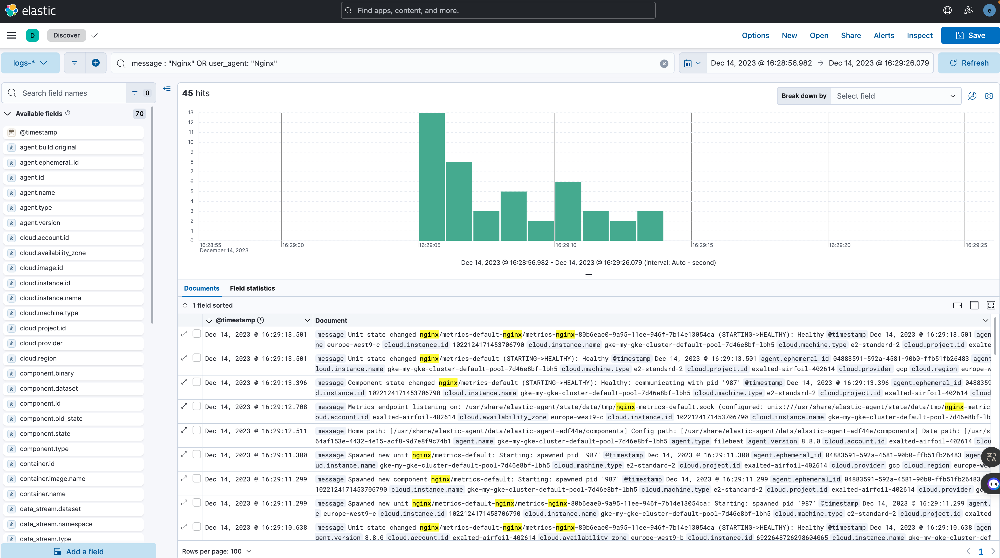

# Documentation for the Centralized Logging and Management Solution with the Elastic Stack:

This documentation details the setup of a monitoring infrastructure using the Elastic Stack. It provides a comprehensive overview of the files and directories associated with this project, making it easier to deploy, manage, and understand the entire architecture.

## Descriptions of Provided Files :

The repository structure is designed to facilitate the deployment and management of a monitoring infrastructure with the Elastic Stack. Here's an overview of the main files and directories:

- `README.md et README-anglais.md` : These files contain the main project documentation, including instructions and information on deployment and management.
- `deploy-gke-cluster` : This directory contains scripts and configurations needed to deploy a Google Kubernetes Engine (GKE) cluster using Ansible and Terraform:
    - **README.md** :This file provides detailed instructions on deploying the GKE cluster using Ansible and Terraform. It also explains the structure of files in this directory.
    - **ansible** : This directory contains Ansible scripts to automate the GKE cluster deployment. Files include configurations (ansible.cfg, inventory.ini), a main playbook (playbook.yml), GKE cluster-specific roles, and variables (vars.yml).
    - **creation-inventory.sh** : A script to create the necessary inventory for Ansible.
    - **credentials.json** : The JSON configuration file required for Google Cloud Platform (GCP) authentication.
    - **deploy.sh** : A script to initiate the GKE cluster deployment.
    - **terraform** : This directory contains Terraform configurations for creating the GCP infrastructure, including VPC, firewall, service account, and the GKE cluster itself.
    - **terraform-destroy.sh** : A script to destroy the infrastructure created with Terraform.
- `kubernetes` : This directory includes Kubernetes configurations for deploying various applications, such as Elasticsearch, Filebeat, Kibana, Logstash, and Nginx:
  - **app** : Contains Kubernetes configurations for deploying the application, with YAML files describing the deployment and service.
  - **elasticsearch, filebeat, kibana, logstash, nginx** : These directories contain Kubernetes configurations specific to each component of the Elastic Stack.
  - **values.yaml** : A values file for global configuration used in Helm deployments.
- `logging-schema` : Contains a schema of log centralization in PDF format, facilitating understanding of the architecture.
- `screenshots` : Screenshots of different views and dashboards related to logs and cluster metric management.
- `tp_5_logging.pdf` : The PDF document associated with the monitoring practical work, providing detailed explanations.


``` shell
. # Arborescence du repository
├── README.md
├── README-anglais.md
├── deploy-gke-cluster
│   ├── README.md
│   ├── ansible
│   │   ├── ansible.cfg
│   │   ├── inventory.ini
│   │   ├── playbook.yml
│   │   ├── roles
│   │   │   └── gke-cluster
│   │   │       ├── handlers
│   │   │       │   └── main.yml
│   │   │       └── tasks
│   │   │           └── main.yml
│   │   └── vars.yml
│   ├── creation-inventory.sh
│   ├── credentials.json
│   ├── deploy.sh
│   ├── terraform
│   │   ├── firewall
│   │   │   ├── main.tf
│   │   │   ├── outputs.tf
│   │   │   └── variables.tf
│   │   ├── gke-cluster
│   │   │   ├── main.tf
│   │   │   ├── outputs.tf
│   │   │   └── variables.tf
│   │   ├── main.tf
│   │   ├── outputs.tf
│   │   ├── service_account
│   │   │   ├── main.tf
│   │   │   ├── outputs.tf
│   │   │   └── variables.tf
│   │   ├── terraform.tfstate
│   │   ├── terraform.tfstate.backup
│   │   ├── variables.tf
│   │   └── vpc
│   │       ├── main.tf
│   │       ├── outputs.tf
│   │       └── variables.tf
│   └── terraform-destroy.sh
├── kubernetes
│   ├── app
│   │   ├── app-deployment.yml
│   │   └── app-service.yml
│   ├── elasticsearch
│   │   ├── elasticsearch-deployment.yaml
│   │   └── elasticsearch-service.yaml
│   ├── filebeat
│   │   ├── filebeat-config.yaml
│   │   └── filebeat-deployment.yaml
│   ├── kibana
│   │   ├── kibana-deployment.yaml
│   │   └── kibana-service.yaml
│   ├── logstash
│   │   ├── logstash-configmap.yaml
│   │   ├── logstash-deployment.yaml
│   │   ├── logstash-nginx-pipeline.conf
│   │   └── logstash-service.yaml
│   ├── nginx
│   │   ├── nginx-deployment.yml
│   │   └── nginx-service.yml
│   └── values.yaml
├── logging-schema
│   └── centralisation-logs.drawio.pdf
├── screenshots
│   ├── Affichage-Dashboard-Cluster-Metrics.png
│   ├── Affichage-Index.png
│   ├── Affichage-Logs-24H.png
│   ├── Affichage-Logs-ConteneurUnique.png
│   ├── Affichage-Logs-NGINX.png
│   ├── Affichages-Logs-Kubernetes-Last1H.png
│   ├── Strategy-GestionLogs-72H-AccessLogs.png
│   └── Strategy-GestionLogs-72H-ErrorLogs.png
└── tp_5_logging.pdf

21 directories, 58 files
```

## Visual Schema of the ELK Monitoring Solution :


## How to Deploy ELK and Applications in the Cluster :

Here is the procedure to configure the GKE cluster, deploy it, and access the monitoring solution:

### Configuration of Variables for Deployment:

### Deployment and Access to Monitoring:

Once you have made these modifications to the variables for all folders, you can execute the Terraform scripts to deploy and configure the GKE cluster on GCP using the following command:

- Navigate to the `deploy-gke-cluster` directory.
- Run the command:
  
``` sh
    bash deploy.sh
```

The `deploy.sh` bash script is an automated deployment script to deploy infrastructure on Google Cloud Platform (GCP) and deploy a GKE cluster in normal mode to finely adjust all its parameters.

- Wait for 6 minutes for the Kubernetes cluster to deploy.
- The sudo command launching Docker automatically may prompt you for the computer's Admin password.
- Open your browser and go to : `localhost:5601`
- Enter the username as  : `elastic`
- Enter the password as the one highlighted in red in the terminal  : ex (eTE2YYBx...)
- Click on `Discover` in the left menu.
- You will see an overview of the logs collected by ELK:



- To add a log collection agent for your application (e.g., NGINX), in the search bar at the top, type the name of your agent (e.g., NGINX).
- Click on `"Add NGINX"`
- Verify that in Configure integration, , `collect logs from NGINX instances` is checked, along with the metrics.
- In `'Where to add this integration`: click on the `'Existing hosts'` tab and select`'Elastic Agent on ECK policy'`
- Click on the hamburger menu, scroll down to `management`, click on `integration`, click on `install integration`, click on `Nginx`, click on `integration policies`, click on `nginx advanced options`, and in the `Ignore events older than` field, set the duration for which you want to retain the logs, here 72 hours.



ENJOY !

---

# Other Methods:

## 1. Description of Provided Files:

   - elasticsearch-deployment.yaml: Deployment file for Elasticsearch.
   - elasticsearch-service.yaml: Service file for Elasticsearch.
   - logstash-deployment.yaml: Deployment file for Logstash.
   - logstash-configmap.yaml: Configuration file for Logstash.
   - filebeat-deployment.yaml: Deployment file for Filebeat.
   - filebeat-configmap.yaml: Configuration file for Filebeat.
   - nginx-logstash-pipeline.conf: Logstash pipeline file for the Nginx application.

## 2. Prerequisites Description:

   - Ensure you have an operational Kubernetes cluster ready to receive new deployments.
   - Ensure you have the necessary rights and permissions to deploy resources in the cluster.

## 3. How to Deploy the Centralized Logging Solution:

  - Apply the deployment files for Elasticsearch, Logstash, and Filebeat using the command `kubectl apply -f <file.yaml>` for each file.
  - Apply the configuration files for Logstash and Filebeat using the command `kubectl apply -f <file.yaml>` for each file.
  - Verify that the deployments are correctly started using `kubectl get pods`.

## 4. How to Deploy the Nginx Application:

  - Apply the deployment file for the Nginx application using the command `kubectl apply -f <file.yaml>`.
  - Verify that the deployment is correctly started using `kubectl get pods`.
  - How to Add New Applications to Log Centralization:

## 5. To add new applications to log centralization, follow these steps:

  - Create a new Logstash pipeline file for the desired application, similar to nginx-logstash-pipeline.conf.
  - Modify the filebeat-configmap.yaml file to include the new log paths for the application.
  - Apply the changes using `kubectl apply -f <file.yaml>` for each file.

## 6. Presentation and Justification of Log Storage and Rotation Strategy:

We have chosen a log storage and rotation strategy based on the following operational criteria:

  - Application logs will be retained for 30 days.
  - Container logs will be retained for 7 days.

This strategy allows for sufficient log retention for retrospective analysis without causing unnecessary storage overload.

Feel free to customize file names and configurations according to the specific needs of your environment. Also, be sure to replace <file.yaml> with the actual file names for deployment in the documentation.

---
## 7. To retrieve logs from the deployed Nginx application in your GKE Kubernetes cluster, as well as logs from other applications that will be added in the future, follow these steps:

  - Configuration of Filebeat for Nginx logs:
  - Deploy Filebeat using a DaemonSet to ensure it is present on each cluster node.

Configure Filebeat to collect Nginx logs by adding an Nginx module to its configuration. Here is an example configuration in the file filebeat-config.yaml:

```yaml
apiVersion: v1
kind: ConfigMap
metadata:
name: filebeat-config
data:
filebeat.yml: |-
    filebeat.inputs:
    - type: log
    enabled: true
    paths:
        - /var/log/nginx/*.log
    fields_under_root: true
    fields:
        type: nginx

    output.logstash:
    hosts: ["logstash:5044"]
```

Ensure that Nginx logs are stored in the /var/log/nginx/ directory on each node. Adjust the path in the configuration if necessary.

### 1. Filebeat Configuration for Future Application Logs:
When deploying new applications in your cluster, configure Filebeat to collect their logs in the same way as for Nginx. You can add new modules or specific configurations for each application.

### 2. Logstash Configuration:
In Logstash, configure pipelines to process logs based on their type (e.g., Nginx, other_application).
Ensure that Logstash is configured to accept data from Filebeat via port 5044, as indicated in the Filebeat configuration.

### 3. Deployment of Applications:
Deploy your applications in the Kubernetes cluster using appropriate YAML deployment files.
Ensure that the logs of these applications are stored in directories accessible by Filebeat on the nodes.
With this configuration, Filebeat will collect logs from Nginx and other applications present on each node of the Kubernetes cluster. The logs will then be sent to Logstash for processing. You can also add new modules or specific configurations as you deploy new applications in the cluster.

To store the logs of each application in its own index and configure a Logstash pipeline for each application, follow these steps:

### 4. Create a Logstash pipeline for each application:
Each Logstash pipeline should be configured to process logs from a specific application. You can create a separate Logstash configuration file for each pipeline. Here is an example Logstash configuration file for Nginx (nginx-pipeline.conf):

``` yaml
input {
beats {
    port => 5044
}
}

filter {
if [fields][type] == "nginx" {
    grok {
    match => { "message" => "%{COMBINEDAPACHELOG}" }
    }
}
# Add other filters specific to Nginx here if necessary.
}

output {
elasticsearch {
    hosts => ["elasticsearch:9200"]
    index => "nginx-%{+YYYY.MM.dd}"
    }
}
```

In this file, the pipeline receives data from Filebeat agents via port 5044.
It applies a filter specific to Nginx logs using Grok.
Finally, it sends the processed data to Elasticsearch in a specific index.

### 5. Create an Elasticsearch index template:
To store logs in separate indexes per application, you need to define an Elasticsearch index template. The template determines the structure and settings of the index. You can create a custom template for each application or use predefined templates based on your needs.

### 6. Documentation on Adding New Applications:
To allow the easy integration of new applications into the existing log collection system, provide documentation describing the following steps:

  - Creating a Logstash configuration file specific to the application.
  - Configuring appropriate Logstash filters and outputs for the application.
  - Creating an Elasticsearch index template for the application, if necessary.
  - Deploying the application in the Kubernetes cluster, ensuring that logs are stored in the correct location.
  - Be sure to include concrete examples in your documentation to demonstrate how to configure Logstash and Filebeat for a new application.

This documentation will enable teams responsible for new applications to seamlessly integrate into the existing log collection system.