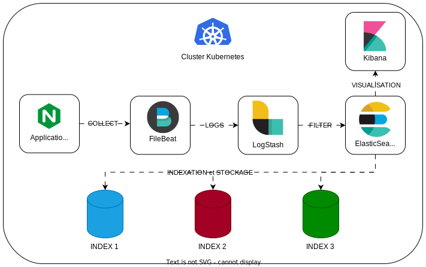

# Documentation de la solution de centralisation et de gestion des logs avec la suite Elastic :

Cette documentation détaille la mise en place d'une infrastructure de monitoring avec la suite Elastic. Elle offre un aperçu complet des fichiers et des répertoires associés à ce projet, facilitant ainsi le déploiement, la gestion et la compréhension de l'ensemble de l'architecture.

## Descriptions des fichiers fournis

L'arborescence du repository est conçue de manière à faciliter le déploiement et la gestion d'une infrastructure de monitoring avec la suite Elastic. Voici une vue d'ensemble des principaux fichiers et répertoires :

- `README.md et README-anglais.md` : Ces fichiers contiennent la documentation principale du projet, avec des instructions et des informations sur le déploiement et la gestion.
- `deploy-gke-cluster` : Ce répertoire contient les scripts et les configurations nécessaires pour déployer un cluster Google Kubernetes Engine (GKE) à l'aide d'Ansible et Terraform :
    - **README.md** : Ce fichier fournit des instructions détaillées sur le déploiement du cluster GKE à l'aide d'Ansible et Terraform. Il explique également la structure des fichiers présents dans ce répertoire.
    - **ansible** : Ce répertoire contient les scripts Ansible nécessaires pour automatiser le déploiement du cluster GKE. Les fichiers incluent des configurations (ansible.cfg, inventory.ini), un playbook principal (playbook.yml), des rôles spécifiques au cluster GKE, et des variables (vars.yml).
    - **creation-inventory.sh** : Un script pour créer l'inventaire nécessaire à Ansible.
    - **credentials.json** : Le fichier de configuration JSON nécessaire pour l'authentification Google Cloud Platform (GCP).
    - **deploy.sh** : Un script pour lancer le déploiement du cluster GKE.
    - **terraform** : Ce répertoire contient les configurations Terraform pour la création de l'infrastructure GCP, y compris le réseau VPC, le pare-feu, le service account, et le cluster GKE lui-même.
    - **terraform-destroy.sh** : Un script pour détruire l'infrastructure créée avec Terraform.
- `kubernetes` : Ce répertoire inclut les configurations Kubernetes pour le déploiement des différentes applications, telles que Elasticsearch, Filebeat, Kibana, Logstash, et Nginx :
  - **app** : Contient les configurations Kubernetes pour le déploiement de l'application, avec des fichiers YAML décrivant le déploiement et le service.
  - **elasticsearch, filebeat, kibana, logstash, nginx** : Ces répertoires contiennent les configurations Kubernetes spécifiques à chaque composant de la suite Elastic.
  - **values.yaml** : Un fichier de valeurs pour la configuration globale utilisé dans les déploiements Helm.
- `logging-schema` : Contient un schéma de la centralisation des logs au format PDF, facilitant la compréhension de l'architecture.
- `screenshots` : Capture d'écran des différents affichages et tableaux de bord liés aux logs et à la gestion des métriques du cluster.
- `tp_5_logging.pdf` : Le document PDF associé au TP sur le monitoring avec des explications détaillées.


``` shell
. # Arborescence du repository
├── README.md
├── README-anglais.md
├── deploy-gke-cluster
│   ├── README.md
│   ├── ansible
│   │   ├── ansible.cfg
│   │   ├── inventory.ini
│   │   ├── playbook.yml
│   │   ├── roles
│   │   │   └── gke-cluster
│   │   │       ├── handlers
│   │   │       │   └── main.yml
│   │   │       └── tasks
│   │   │           └── main.yml
│   │   └── vars.yml
│   ├── creation-inventory.sh
│   ├── credentials.json
│   ├── deploy.sh
│   ├── terraform
│   │   ├── firewall
│   │   │   ├── main.tf
│   │   │   ├── outputs.tf
│   │   │   └── variables.tf
│   │   ├── gke-cluster
│   │   │   ├── main.tf
│   │   │   ├── outputs.tf
│   │   │   └── variables.tf
│   │   ├── main.tf
│   │   ├── outputs.tf
│   │   ├── service_account
│   │   │   ├── main.tf
│   │   │   ├── outputs.tf
│   │   │   └── variables.tf
│   │   ├── terraform.tfstate
│   │   ├── terraform.tfstate.backup
│   │   ├── variables.tf
│   │   └── vpc
│   │       ├── main.tf
│   │       ├── outputs.tf
│   │       └── variables.tf
│   └── terraform-destroy.sh
├── kubernetes
│   ├── app
│   │   ├── app-deployment.yml
│   │   └── app-service.yml
│   ├── elasticsearch
│   │   ├── elasticsearch-deployment.yaml
│   │   └── elasticsearch-service.yaml
│   ├── filebeat
│   │   ├── filebeat-config.yaml
│   │   └── filebeat-deployment.yaml
│   ├── kibana
│   │   ├── kibana-deployment.yaml
│   │   └── kibana-service.yaml
│   ├── logstash
│   │   ├── logstash-configmap.yaml
│   │   ├── logstash-deployment.yaml
│   │   ├── logstash-nginx-pipeline.conf
│   │   └── logstash-service.yaml
│   ├── nginx
│   │   ├── nginx-deployment.yml
│   │   └── nginx-service.yml
│   └── values.yaml
├── logging-schema
│   └── centralisation-logs.drawio.pdf
├── screenshots
│   ├── Affichage-Dashboard-Cluster-Metrics.png
│   ├── Affichage-Index.png
│   ├── Affichage-Logs-24H.png
│   ├── Affichage-Logs-ConteneurUnique.png
│   ├── Affichage-Logs-NGINX.png
│   ├── Affichages-Logs-Kubernetes-Last1H.png
│   ├── Strategy-GestionLogs-72H-AccessLogs.png
│   └── Strategy-GestionLogs-72H-ErrorLogs.png
└── tp_5_logging.pdf

21 directories, 58 files
```

## Schéma visuel de la solution de monitoring ELK



## Comment déployer ELK et les applications dans le cluster :

Voici la procédure a suivre pour paramétrer le cluster GKE, le déployer et accéder a la solution de monitoring : 

### Paramétrage des variables pour le déploiement:

### Déploiement et accès au monitoring:

Une fois que vous avez effectué ces modifications des variables pour l'ensemble des dossiers, vous pouvez exécuter les scripts Terraform pour déployer et configurer le cluster GKE sur GCP en utilisant la commande suivante :

- se placer dans le dossier deploy-gke-cluster
- lancer la commande :
  
``` sh
    bash deploy.sh
```

Le script bash `deploy.sh` est un script de déploiement automatisé pour déployer une infrastructure sur Google Cloud Platform (GCP) et déployer un cluster GKE en mode normal afin de pouvoir régler finement tous les paramètres de celui ci.

- attendre 6 minutes que le cluster Kubernetes soit déployé
- la commande sudo qui lance Docker automatiquement peut vous demander le MDP Admin de l'ordinateur
- aller sur votre navigateur a cette URL : `localhost:5601`
- renseigner le nom d'utilisateur par : `elastic`
- renseigner le MDP par celui en rouge souligné dans le terminal : ex (eTE2YYBx...)
- cliquer sur `"Discover" dans le menu de gauche
- vous avez un apercu des logs récupérés par ELK :


- pour rajouter un agent de collecte de logs pour votre application (ici NGINX), dans la barre de recherche en haut taper le nom de votre agent (ici NGINX)
- cliquer sur `"Add NGINX"`
- verifier que dans Configure intégration , `collect logs from NGINX instances` est coché ainsi que les metrics
- dans 'Where to add this integration': cliquer sur l'onglet `'Existing hosts'` et sélectionner `'Elastic Agent on ECK policy'`
  
- cliquer sur hamburger, scroll down jusqu'a management, cliquer sur integration, cliquer sur `installer d'integration`, cliquer sur `Nginx`, cliquer sur `integration policies`, cliquer sur `nginx advanced options` , dans le champ Ignore events older than mettre la durée pour laquelle vous voulez conserver les logs ici 72h.


ENJOY !

# Autres méthodes :

1- Description des fichiers fournis :

    - elasticsearch-deployment.yaml: Fichier de déploiement pour Elasticsearch.
    - elasticsearch-service.yaml: Fichier de service pour Elasticsearch.
    - logstash-deployment.yaml: Fichier de déploiement pour Logstash.
    - logstash-configmap.yaml: Fichier de configuration pour Logstash.
    - filebeat-deployment.yaml: Fichier de déploiement pour Filebeat.
    - filebeat-configmap.yaml: Fichier de configuration pour Filebeat.
    - nginx-logstash-pipeline.conf: Fichier de pipeline Logstash pour l'application Nginx.

2- Description des pré-requis :

    - Assurez-vous d'avoir un cluster Kubernetes opérationnel et prêt à recevoir de nouveaux déploiements.
    - Assurez-vous d'avoir les droits et les autorisations nécessaires pour déployer des ressources dans le cluster.

4- Comment déployer la solution de centralisation des logs :

    a- Appliquez les fichiers de déploiement pour Elasticsearch, Logstash et Filebeat en utilisant la commande kubectl apply -f <fichier.yaml> pour chaque fichier.
    b- Appliquez les fichiers de configuration pour Logstash et Filebeat en utilisant la commande kubectl apply -f <fichier.yaml> pour chaque fichier.
    c- Vérifiez que les déploiements sont correctement démarrés en utilisant kubectl get pods.

5- Comment déployer l'application Nginx :

    a- Appliquez le fichier de déploiement pour l'application Nginx en utilisant la commande kubectl apply -f <fichier.yaml>.
    b- Vérifiez que le déploiement est correctement démarré en utilisant kubectl get pods.

6- Comment ajouter de nouvelles applications à la centralisation des logs :

Pour ajouter de nouvelles applications à la centralisation des logs, suivez ces étapes :

    a- Créez un nouveau fichier de pipeline Logstash pour l'application souhaitée, similaire à nginx-logstash-pipeline.conf.
    b- Modifiez le fichier filebeat-configmap.yaml pour inclure les nouveaux chemins de logs de l'application.
    c- Appliquez les modifications en utilisant kubectl apply -f <fichier.yaml> pour chaque fichier.

7- Présentation et justification de la stratégie de stockage et de rotation des logs :

Nous avons choisi une stratégie de stockage et de rotation des logs basée sur les critères opérationnels suivants :

    - Les logs des applications seront conservés pendant 30 jours.
    - Les logs des conteneurs seront conservés pendant 7 jours.

Cette stratégie permet de conserver suffisamment de logs pour une analyse rétrospective sans engendrer une surcharge de stockage inutile.

N'hésitez pas à personnaliser les noms de fichiers et les configurations en fonction des besoins spécifiques de votre environnement. Veillez également à remplacer <fichier.yaml> par les noms de fichiers réels pour les commandes de déploiement dans la documentation.

---

Pour récupérer les journaux de l'application Nginx déployée dans votre cluster Kubernetes GKE, ainsi que les journaux d'autres applications qui seront ajoutées à l'avenir, vous pouvez suivre ces étapes :

1. Configuration de Filebeat pour les journaux de Nginx :

Déployez Filebeat en utilisant un DaemonSet pour qu'il soit présent sur chaque nœud du cluster.
Configurez Filebeat pour collecter les journaux de Nginx en ajoutant un module Nginx à sa configuration. Voici un exemple de configuration dans le fichier filebeat-config.yaml :

    ```yaml
    Copy code
    apiVersion: v1
    kind: ConfigMap
    metadata:
    name: filebeat-config
    data:
    filebeat.yml: |-
        filebeat.inputs:
        - type: log
        enabled: true
        paths:
            - /var/log/nginx/*.log
        fields_under_root: true
        fields:
            type: nginx

        output.logstash:
        hosts: ["logstash:5044"]
    ```

Assurez-vous que les journaux Nginx sont stockés dans le répertoire /var/log/nginx/ sur chaque nœud. Vous pouvez ajuster le chemin dans la configuration si nécessaire.

2. Configuration de Filebeat pour les futurs journaux d'applications :

Lorsque vous déployez de nouvelles applications dans votre cluster, configurez Filebeat pour collecter leurs journaux de la même manière que pour Nginx. Vous pouvez ajouter de nouveaux modules ou des configurations spécifiques pour chaque application.

3. Configuration de Logstash :

Dans Logstash, configurez des pipelines pour traiter les journaux en fonction de leur type (par exemple, Nginx, autre_application).
Assurez-vous que Logstash est configuré pour accepter les données de Filebeat via le port 5044, comme indiqué dans la configuration Filebeat.

4. Déploiement des applications :

Déployez vos applications dans le cluster Kubernetes en utilisant des fichiers de déploiement YAML appropriés.
Veillez à ce que les journaux de ces applications soient stockés dans des répertoires accessibles par Filebeat sur les nœuds.
Avec cette configuration, Filebeat collectera les journaux de Nginx et d'autres applications présentes sur chaque nœud du cluster Kubernetes. Les journaux seront ensuite acheminés vers Logstash pour le traitement. Vous pourrez également ajouter de nouveaux modules ou configurations spécifiques à mesure que vous déployez de nouvelles applications dans le cluster.

---

Pour stocker les journaux de chaque application dans son propre index et configurer un pipeline Logstash pour chaque application, suivez ces étapes :

1. Créez un pipeline Logstash pour chaque application :

Chaque pipeline Logstash doit être configuré pour traiter les journaux d'une application spécifique. Vous pouvez créer un fichier de configuration Logstash distinct pour chaque pipeline. Voici un exemple de fichier de configuration Logstash pour Nginx (nginx-pipeline.conf) :

    ``` yaml
    input {
    beats {
        port => 5044
    }
    }

    filter {
    if [fields][type] == "nginx" {
        grok {
        match => { "message" => "%{COMBINEDAPACHELOG}" }
        }
    }
    # Ajoutez d'autres filtres spécifiques à Nginx ici si nécessaire.
    }

    output {
    elasticsearch {
        hosts => ["elasticsearch:9200"]
        index => "nginx-%{+YYYY.MM.dd}"
        }
    }
    ```

Dans ce fichier, le pipeline reçoit des données des agents Filebeat via le port 5044.
Il applique un filtre spécifique aux journaux Nginx en utilisant Grok.
Enfin, il envoie les données traitées à Elasticsearch dans un index spécifique.
2. Créez un modèle d'index Elasticsearch :

Pour que les journaux soient stockés dans des index distincts par application, vous devez définir un modèle d'index Elasticsearch. Le modèle détermine la structure et les paramètres de l'index. Vous pouvez créer un modèle personnalisé pour chaque application ou utiliser des modèles prédéfinis en fonction de vos besoins.

3. Documentation sur l'ajout de nouvelles applications :

Pour permettre l'ajout de nouvelles applications dans le cluster avec un minimum d'effort, fournissez une documentation décrivant les étapes suivantes :

Création d'un fichier de configuration Logstash spécifique à l'application.
Configuration des filtres et des sorties Logstash appropriés pour l'application.
Création d'un modèle d'index Elasticsearch pour l'application, si nécessaire.
Déploiement de l'application dans le cluster Kubernetes en veillant à ce que les journaux soient stockés au bon emplacement.
Assurez-vous d'inclure des exemples concrets dans votre documentation pour montrer comment configurer Logstash et Filebeat pour une nouvelle application. Cette documentation permettra aux équipes responsables des nouvelles applications de s'intégrer facilement dans le système de collecte de journaux existant.
